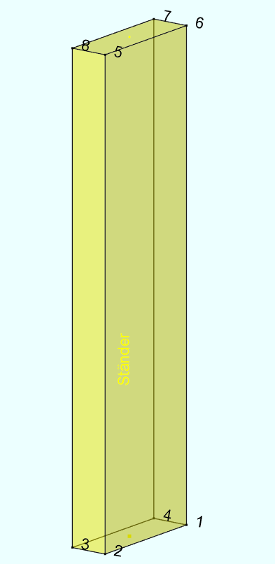

# BREP

## Was ist BREP? (Boundary Representation)

**BREP** steht für **Boundary Representation** – eine Methode zur Beschreibung von **3D-Volumenkörpern** durch ihre *
*Grenzen**.

---

## Grundidee

Ein 3D-Volumen wird durch folgende Bestandteile definiert:

| Komponente | Beschreibung                              | `geometry_controller`                                                                |
|------------|-------------------------------------------|--------------------------------------------------------------------------------------|
| **Vertex** | Punkt im Raum (Ecke)                      | `get_element_vertices`                                                               |
| **Edge**   | Verbindung zwischen zwei Vertices (Kante) | `not accessible`                                                                     |
| **Face**   | Begrenzungsfläche aus verbundenen Kanten  | `facets = gc.get_element_facets()`                                                   |
| **Loop**   | Geschlossener Randverlauf einer Fläche    | `facets = gc.get_element_facets(); facets.get_external_polygon_for_reference_face()` |
| **Shell**  | Geschlossene Hülle aus mehreren Flächen   | `not accessible`                                                                     |

BREP beschreibt also nicht das Innere des Körpers, sondern **nur seine äussere Hülle**.

---

## Orientierung & Rechtshändigkeit

## Rechte-Hand-Koordinatensystem (Daumen = X)

- **Daumen**: X-Achse
- **Zeigefinger**: Y-Achse
- **Mittelfinger**: Z-Achse

Wenn du zwei Richtungsvektoren v1 und v2 hast (aus Punkten auf einer Fläche):

- Das Kreuzprodukt `v1 × v2` ergibt einen Vektor **senkrecht zur Fläche**
- Die Richtung der Fläche ergibt sich aus der Punktreihenfolge nach der Rechte-Hand-Regel

Beispiel:

- Punkte im Raum: A → B → C
- `v1 = B - A`, `v2 = C - A`
- Normale `n = v1 × v2`

---

### 🖐️ Rechte-Hand-Regel (für Flächennormalen)

Wenn du wissen willst, **in welche Richtung eine Fläche zeigt** (z.B. nach aussen oder innen), kannst du die
**Rechte-Hand-Regel** benutzen:

1. **Lege drei Punkte fest**, die eine Fläche bilden – z. B. **A → B → C**.
2. **Nimm deine rechte Hand**:

    * Zeige mit den Fingern in der **Reihenfolge der Punkte** (also A → B → C).
3. Dann zeigt der **Daumen automatisch senkrecht zur Fläche** – das ist die **Richtung der Flächennormalen** (also "
   oben" oder "außen").

---

#### Beispiel

* Du hast eine Fläche in der XY-Ebene:

    * Punkt A: (0, 0, 0)
    * Punkt B: (1, 0, 0)
    * Punkt C: (0, 1, 0)
* Die Punkte verlaufen **gegen den Uhrzeigersinn**.

Dann zeigt dein Daumen (= Normale) **nach oben in Z-Richtung (+Z)** → die Fläche zeigt nach oben.

---

#### Merksatz:

> Wenn du mit der **rechten Hand der Punktreihenfolge folgst**, zeigt der **Daumen senkrecht aus der Fläche heraus** –
> das ist die **Normale**.

---

## Gegensätzliche Orientierung bei gegenüberliegenden Flächen

* Zwei gegenüberliegende Flächen (z. B. Front und Rückseite eines Würfels) haben **entgegengesetzte Orientierung**, um
  ihre Normalen **nach aussen** zeigen zu lassen.
* → Eine Fläche läuft **im Uhrzeigersinn**, die andere **gegen den Uhrzeigersinn**.

---

## Warum ist das wichtig?

* **Normals** sind entscheidend für:

    * Lichtberechnung (Shading)
    * Booleans

* **Falsche Orientierung** kann zu:

    * "Invertierten" Objekten
    * Fehlerhaften Volumina
    * Problemen beim 3D-Druck führen

---

> BREP beschreibt **nicht was drin ist**, sondern **wo aussen ist** – mit sauberer Orientierung und klarer Topologie.
> Topologie beschreibt die Verbindung und Struktur der Geometrie, unabhängig von den genauen Koordinaten der Punkte.
> Ein Kaffeebecher und ein Donut haben topologisch dieselbe Struktur: → Beide haben ein Loch → ihre Topologie ist
> gleich, auch wenn ihre Form unterschiedlich ist.

| Begriff       | Geometrie                | Topologie                               |
|---------------|--------------------------|-----------------------------------------|
| Punktposition | (z. B. x=0, y=0, z=0)    | Ist dieser Punkt mit anderen verbunden? |
| Kante         | hat eine räumliche Kurve | Verbindet sie zwei bestimmte Punkte?    |
| Fläche        | hat eine Fläche im Raum  | Welche Kanten umranden sie?             |

---

[gamemath book](https://gamemath.com/book/cartesianspace.html#3d_hands)
