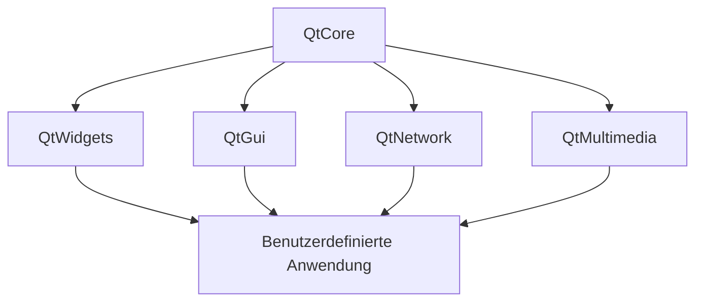
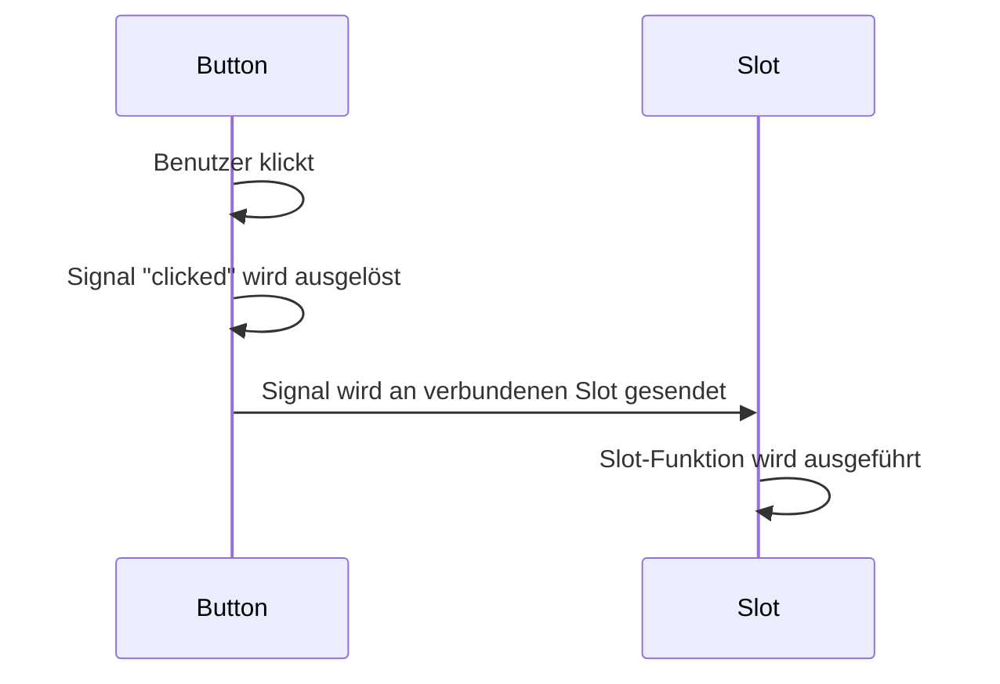
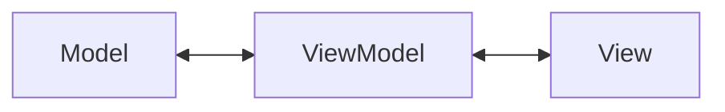

# PyQt5 Grundlagen

## Lizenzbedingungen von PyQt5

PyQt5 wird von Riverbank Computing entwickelt und unterliegt spezifischen Lizenzbedingungen, die vor der Verwendung
berücksichtigt werden müssen:

### Lizenzoptionen

1. **GPL v3 Lizenz**:
    - PyQt5 ist unter der GNU General Public License (GPL) Version 3 verfügbar.
    - Bei Verwendung dieser Lizenz **muss Ihre Anwendung ebenfalls unter GPL v3 veröffentlicht werden**.
    - Der gesamte Quellcode Ihrer Anwendung muss für Endbenutzer zugänglich gemacht werden.

2. **Kommerzielle Lizenz**:
    - Für Anwendungen, die nicht unter GPL veröffentlicht werden sollen, ist eine kommerzielle Lizenz erforderlich.
    - Diese kann von Riverbank Computing erworben
      werden: [https://riverbankcomputing.com/commercial/pyqt](https://riverbankcomputing.com/commercial/pyqt)
    - Die kommerzielle Lizenz erlaubt die Erstellung proprietärer (geschlossener) Anwendungen.

### Wichtige Hinweise zur Einhaltung der Lizenzbedingungen

- **Anwendungen unter GPL**:
    - Der vollständige Quellcode muss verfügbar sein.
    - Alle Änderungen am Code müssen dokumentiert werden.
    - Die Lizenz muss in der Anwendung angegeben werden.
    - Benutzer müssen über ihre Rechte unter der GPL informiert werden.

> **Hinweis**: Die Informationen in diesem Dokument stellen keine Rechtsberatung dar. Konsultieren Sie bei
> Unsicherheiten bezüglich der Lizenzierung einen Rechtsexperten oder kontaktieren Sie Riverbank Computing direkt.

## Installation von PyQt5 für Windows

Um mit PyQt5-Entwicklung zu beginnen, müssen Sie PyQt5 selbst sowie einige Hilfswerkzeuge installieren. Diese Anleitung
konzentriert sich auf die Installation unter Windows.

### Voraussetzungen

- Python 3.6 oder höher (empfohlen: Python 3.8+)
    - für cadwork v2025 benötigst du Python 3.12
- Pip (Python Package Installer, normalerweise mit Python installiert)
- Windows 10/11

### 1. Installation von PyQt5

Die einfachste Methode zur Installation von PyQt5 ist über pip:

```bash
pip install PyQt5
```

### 2. Installation von PyQt5-Tools

Die PyQt5-Tools enthalten wichtige Hilfsprogramme wie Qt Designer, Qt Linguist und andere:

```bash
pip install pyqt5-tools
```

### 3. Qt Designer finden und starten

Nach der Installation von `pyqt5-tools` befindet sich Qt Designer in einem der folgenden Verzeichnisse:

- `%PYTHON_INSTALL_DIR%\Lib\site-packages\pyqt5_tools\designer.exe`
- `%PYTHON_INSTALL_DIR%\Scripts\designer.exe`

Sie können den Designer auch über die Kommandozeile starten:

```bash
pyqt5-tools designer
```

### 4. Installation von pyuic5 und pyrcc5 Konvertierungswerkzeugen

Diese Werkzeuge werden für die Konvertierung von .ui- und .qrc-Dateien benötigt:

- **pyuic5**: Konvertiert Qt Designer .ui-Dateien in Python-Code
- **pyrcc5**: Konvertiert Qt Resource .qrc-Dateien in Python-Code

Sie sind normalerweise bereits mit der PyQt5-Installation enthalten. Sie können sie über die Kommandozeile aufrufen:

```bash
# UI-Datei in Python-Code konvertieren
pyuic5 mainwindow.ui -o ui_mainwindow.py

# QRC-Datei in Python-Code konvertieren
pyrcc5 resources.qrc -o resources_rc.py
```

### 5. Überprüfung der Installation

Um zu überprüfen, ob PyQt5 korrekt installiert wurde, führen Sie folgendes Python-Skript aus:

```python
import sys
from PyQt5.QtWidgets import QApplication, QLabel

app = QApplication(sys.argv)
label = QLabel("PyQt5 ist erfolgreich installiert!")
label.show()
sys.exit(app.exec_())
```

#### 6. Standalone Installer

Riverbank Computing bietet auch eigenständige Installer für PyQt5 an, die von ihrer Website heruntergeladen werden
können. https://riverbankcomputing.com/software/pyqt/download

Diese Dokumentation bietet einen Überblick über die Grundlagen von PyQt5 und effiziente Implementierungsmuster für die
Arbeit mit CAD-Elementen unter Verwendung der cwapi3d.

## Inhaltsverzeichnis

- [Lizenzbedingungen von PyQt5](#lizenzbedingungen-von-pyqt5)
- [Installation von PyQt5 für Windows](#installation-von-pyqt5-für-windows)
- [Was ist PyQt5?](#was-ist-pyqt5)
- [Qt-Architektur und Funktionsweise](#qt-architektur-und-funktionsweise)
- [Effiziente PyQt5-Entwicklung](#effiziente-pyqt5-entwicklung)
- [Qt Designer für UI-Entwicklung](#qt-designer-für-ui-entwicklung)
- [Ressourcenverwaltung mit QRC](#ressourcenverwaltung-mit-qrc)
- [Qt Stylesheets](#qt-stylesheets)
- [Das MVVM-Muster](#das-mvvm-muster)
- [Praktisches Beispiel: CAD-Elementeverwaltung](#praktisches-beispiel-cad-elementeverwaltung)
- [Integration mit cwapi3d](#integration-mit-cwapi3d)

## Was ist PyQt5?

PyQt5 ist eine Python-Bibliothek, die Qt5 - ein umfangreiches C++-Framework für die Entwicklung von
plattformübergreifenden Anwendungen mit grafischer Benutzeroberfläche - in Python verfügbar macht.

PyQt5 bietet Zugriff auf:

- Widget-Bibliotheken für UI-Elemente
- Signale und Slots für ereignisgesteuerte Programmierung
- Grafikeffekte und Animationen
- Netzwerkunterstützung
- Multimedia-Funktionalitäten
- Multithreading-Unterstützung

## Qt-Architektur und Funktionsweise

QtCore ist das Fundament von Qt, auf dem alle anderen Module aufbauen. Die Architektur von Qt basiert auf mehreren
wichtigen Konzepten:



### Wichtige Konzepte in Qt:

1. **Signale und Slots**: Mechanismus für die Kommunikation zwischen Objekten (Observer-Pattern)
2. **Event Loop**: Herzstück der Anwendung, verarbeitet Ereignisse
3. **Widgets**: UI-Komponenten, die vom Benutzer gesehen und verwendet werden
4. **Layouts**: Organisieren Widgets in einer ansprechenden und responsiven Struktur
5. **Model/View-Architektur**: Trennt Daten (Modell) von Darstellung (View)

### Signal-Slot-Mechanismus




Der Signal-Slot-Mechanismus ist das Herzstück der ereignisgesteuerten Programmierung in Qt. Es ermöglicht eine lose
Kopplung von Objekten, sodass diese miteinander kommunizieren können, ohne voneinander abhängig zu sein.

#### Grundprinzipien

1. **Signale**: Werden von Objekten emittiert, wenn ein bestimmtes Ereignis eintritt
2. **Slots**: Funktionen, die aufgerufen werden, wenn ein verbundenes Signal ausgelöst wird
3. **Verbindungen**: Verknüpfen ein Signal mit einem oder mehreren Slots

#### Signale definieren

In PyQt5 werden Signale mit der `pyqtSignal`-Klasse definiert:

```python
from PyQt5.QtCore import QObject, pyqtSignal


class Counter(QObject):
    # Signal ohne Parameter
    countChanged = pyqtSignal()

    # Signal mit einem int-Parameter
    valueChanged = pyqtSignal(int)

    # Signal mit mehreren Parametern
    rangeChanged = pyqtSignal(int, int)

    # Signal mit unterschiedlichen Signaturvarianten
    statusChanged = pyqtSignal([int], [str])
```

#### Slots definieren

Slots sind einfach Python-Methoden. Mit dem `@pyqtSlot`-Dekorator können Sie die Signatur explizit angeben:

```python
from PyQt5.QtCore import pyqtSlot


class Display(QObject):
    @pyqtSlot()  # Slot ohne Parameter
    def refresh(self):
        print("Display wird aktualisiert")

    @pyqtSlot(int)  # Slot mit einem int-Parameter
    def showValue(self, value):
        print(f"Neuer Wert: {value}")

    @pyqtSlot(int, int)  # Slot mit zwei int-Parametern
    def setRange(self, min_value, max_value):
        print(f"Neuer Bereich: {min_value} bis {max_value}")
```

#### Signale und Slots verbinden

Um ein Signal mit einem Slot zu verbinden, verwenden Sie die `connect`-Methode:

```python
# Objekte erstellen
counter = Counter()
display = Display()

# Signale mit Slots verbinden
counter.countChanged.connect(display.refresh)
counter.valueChanged.connect(display.showValue)
counter.rangeChanged.connect(display.setRange)
```

#### Signale emittieren

Um ein Signal auszulösen, rufen Sie die `emit`-Methode auf:

```python
class Counter(QObject):
    # ... (Signale wie oben definiert)

    def increment(self):
        self._value += 1
        # Signal ohne Parameter emittieren
        self.countChanged.emit()
        # Signal mit Parameter emittieren
        self.valueChanged.emit(self._value)

    def setRange(self, min_value, max_value):
        # Signal mit mehreren Parametern emittieren
        self.rangeChanged.emit(min_value, max_value)
```

#### Fortgeschrittene Techniken

1. **Verbindungstypen**: Qt bietet verschiedene Arten der Verbindung:
   ```python
   # Standardverbindung (Auto-Connection)
   button.clicked.connect(self.handle_click)

   # Direkte Verbindung (synchron)
   button.clicked.connect(self.handle_click, Qt.DirectConnection)

   # Warteschlangen-Verbindung (asynchron)
   button.clicked.connect(self.handle_click, Qt.QueuedConnection)
   ```

2. **Lambda-Funktionen**: Für einfache Anpassungen können Lambda-Funktionen verwenden:
   ```python
   # Slot mit angepasstem Parameter aufrufen
   slider.valueChanged.connect(lambda value: label.setText(f"Wert: {value}%"))
   ```

3. **Signalverbindungen trennen**:
   ```python
   # Einzelne Verbindung trennen
   button.clicked.disconnect(self.handle_click)

   # Alle Verbindungen trennen
   button.clicked.disconnect()
   ```

4. **Signale zwischen Threads**: Bei der Verwendung mehrerer Threads ist `Qt.QueuedConnection` wichtig, um
   Thread-Sicherheit zu gewährleisten.

## Effiziente PyQt5-Entwicklung

Für eine effiziente Entwicklung mit PyQt5 empfehlen sich folgende Praktiken:

1. **Qt Designer verwenden**: GUI visuell erstellen und als .ui-Datei speichern
2. **Architekturen anwenden**: MVVM für saubere Codestrukturierung
3. **Ressourcen verwalten**: QRC-Dateien für eingebettete Ressourcen nutzen
4. **Multithreading**: Für rechenintensive Operationen, um UI-Blockierung zu vermeiden
5. **Stylesheet-Anpassung**: Für einheitliches und ansprechendes Design

### Beispiel für eine einfache PyQt5-Anwendung:

```python
import sys
from PyQt5.QtWidgets import QApplication, QMainWindow, QPushButton


class MainWindow(QMainWindow):
    def __init__(self):
        super().__init__()
        self.setWindowTitle("Meine erste PyQt5-App")
        self.setGeometry(100, 100, 400, 300)

        button = QPushButton("Klick mich", self)
        button.setGeometry(150, 150, 100, 30)
        button.clicked.connect(self.button_clicked)

    def button_clicked(self):
        print("Button wurde geklickt!")


if __name__ == "__main__":
    app = QApplication(sys.argv)
    window = MainWindow()
    window.show()
    sys.exit(app.exec_())
```

## Qt Designer für UI-Entwicklung

 

[Qt-Designer-Manual](https://doc.qt.io/qt-6/designer-quick-start.html)

Der Qt Designer ist ein leistungsstarkes visuelles Tool zur Gestaltung von Benutzeroberflächen für Qt-Anwendungen.
Anstatt UIs manuell zu programmieren, können Sie Widgets per Drag-and-Drop platzieren, Eigenschaften konfigurieren und
Layouts visuell gestalten.

### Grundlegende Verwendung des Qt Designers

1. **Installation**: Der Qt Designer ist Teil von Qt und kann als eigenständige Anwendung oder als Teil von QtCreator
   installiert werden.

2. **UI-Datei erstellen**: Im Designer erstellte Layouts werden als `.ui`-Dateien gespeichert (XML-Format).

3. **Widgets und Layouts**: Per Drag-and-Drop können Widgets platziert und mit Layouts (Grid, VBox, HBox, Form)
   organisiert werden.

4. **Eigenschaften einstellen**: Jedes Widget hat konfigurierbare Eigenschaften wie Name, Größe, Stil, Text usw.

5. **Signale und Slots verbinden**: Über den Signal/Slot-Editor können Verbindungen zwischen Widgets definiert werden.

### Integration in Python-Code

Es gibt zwei Hauptmethoden, um UI-Dateien in PyQt5-Code zu integrieren:

#### 1. Direkte Verwendung über `uic.loadUi()`

```python
import sys
from PyQt5 import QtWidgets, uic


class MainWindow(QtWidgets.QMainWindow):
    def __init__(self):
        super().__init__()

        # UI-Datei direkt laden
        uic.loadUi('mainwindow.ui', self)

        # Auf Widgets zugreifen (durch ihre objectName-Eigenschaft)
        self.pushButton = self.findChild(QtWidgets.QPushButton, 'pushButton')
        self.pushButton.clicked.connect(self.button_clicked)

    def button_clicked(self):
        print("Button wurde geklickt!")


if __name__ == "__main__":
    app = QtWidgets.QApplication(sys.argv)
    window = MainWindow()
    window.show()
    sys.exit(app.exec_())
```

#### 2. Konvertierung in Python-Code mit `pyuic5`

Die `.ui`-Datei kann mit dem Tool `pyuic5` in Python-Code umgewandelt werden:

```bash
pyuic5 mainwindow.ui -o ui_mainwindow.py
```

Dieser generierte Code kann dann importiert und verwendet werden:

```python
import sys
from PyQt5 import QtWidgets
from ui_mainwindow import Ui_MainWindow


class MainWindow(QtWidgets.QMainWindow, Ui_MainWindow):
    def __init__(self):
        super().__init__()

        # UI-Klasse initialisieren
        self.setupUi(self)

        # Signale verbinden
        self.pushButton.clicked.connect(self.button_clicked)

    def button_clicked(self):
        print("Button wurde geklickt!")


if __name__ == "__main__":
    app = QtWidgets.QApplication(sys.argv)
    window = MainWindow()
    window.show()
    sys.exit(app.exec_())
```

### Vorteile und Best Practices

- **Trennung von UI und Logik**: UI-Design und Code-Logik werden getrennt, was die Wartung erleichtert
- **Schnellere Entwicklung**: Visuelles Design ist oft schneller als manuelles Programmieren
- **Konsistentes Layout**: Layouts passen sich automatisch an Größenänderungen an
- **Generierter Code aktualisieren**: Bei UI-Änderungen die Python-Datei neu generieren, ohne manuelle Änderungen zu
  verlieren

## Ressourcenverwaltung mit QRC

Qt Resource-Dateien (QRC) bieten eine Möglichkeit, Ressourcen wie Bilder, Icons, Übersetzungen und andere Dateien direkt
in die Anwendung einzubetten. Dies erleichtert die Verteilung der Anwendung und ermöglicht einen effizienten Zugriff auf
Ressourcen zur Laufzeit.

### Grundlagen von QRC-Dateien

QRC-Dateien sind XML-Dokumente, die die einzubettenden Ressourcen definieren. Sie werden in C++-Code kompiliert oder für
Python in Python-Code umgewandelt.

#### Beispiel einer QRC-Datei (resources.qrc):

```xml
<!DOCTYPE RCC>
<RCC version="1.0">
    <qresource>
        <file>images/logo.png</file>
        <file>images/icon.ico</file>
        <file>styles/main.css</file>
        <file>data/config.json</file>
    </qresource>
</RCC>
```

### Kompilierung und Verwendung in Python

#### 1. Kompilieren der QRC-Datei

Verwenden Sie das `pyrcc5`-Tool, um die QRC-Datei in Python-Code umzuwandeln:

```bash
pyrcc5 resources.qrc -o resources_rc.py
```

#### 2. Importieren und Verwenden der Ressourcen

```python
import resources_rc  # Wichtig: Immer importieren, auch wenn scheinbar ungenutzt
from PyQt5.QtWidgets import QMainWindow, QLabel
from PyQt5.QtGui import QPixmap


class MainWindow(QMainWindow):
    def __init__(self):
        super().__init__()
        self.setWindowTitle("QRC-Beispiel")

        # Bild aus eingebetteten Ressourcen laden
        label = QLabel(self)
        pixmap = QPixmap(":/images/logo.png")  # Beachten Sie den Präfix ":/"
        label.setPixmap(pixmap)
        self.setCentralWidget(label)
```

### Ressourcen in Designer-UI-Dateien verwenden

Ressourcen können auch direkt im Qt Designer verwendet werden:

1. Im Designer unter **Form → View Resources** die QRC-Datei laden
2. Die Ressourcen sind nun im Designer verfügbar (z.B. für Icons, Hintergrundbilder)
3. Nach der Generierung der UI-Datei muss die entsprechende Resource-Datei (resources_rc.py) importiert werden

### Vorteile der QRC-Ressourcenverwaltung

1. **Portabilität**: Alle Ressourcen sind in die Anwendung eingebettet
2. **Effizienz**: Schnellerer Zugriff als von der Festplatte
3. **Sicherheit**: Ressourcen können nicht versehentlich gelöscht oder verändert werden
4. **Einfache Verteilung**: Kein separates Verpacken von Ressourcendateien nötig

### Namensräume in QRC-Dateien

Ressourcen können in verschiedene Namensräume organisiert werden:

```xml
<!DOCTYPE RCC>
<RCC version="1.0">
    <qresource prefix="/icons">
        <file>icons/save.png</file>
        <file>icons/open.png</file>
    </qresource>
    <qresource prefix="/styles">
        <file>styles/dark.css</file>
        <file>styles/light.css</file>
    </qresource>
</RCC>
```

Zugriff erfolgt dann über den entsprechenden Präfix:

```python
icon = QIcon(":/icons/save.png")
```

### Beispiel: Stylesheets aus Ressourcen laden

```python
import resources_rc
from PyQt5.QtWidgets import QApplication, QMainWindow


class StyledWindow(QMainWindow):
    def __init__(self):
        super().__init__()
        self.setWindowTitle("Styled Application")

        # Stylesheet aus Ressource laden
        with open(":/styles/main.css", "r") as f:
            style = f.read()
            self.setStyleSheet(style)


if __name__ == "__main__":
    app = QApplication([])
    window = StyledWindow()
    window.show()
    app.exec_()
```

## Qt Stylesheets

[stylesheet-examples](https://doc.qt.io/qt-6/stylesheet-examples.html)

Qt unterstützt Stylesheets, die auf CSS basieren und eine leistungsstarke Möglichkeit bieten, das Erscheinungsbild von
Qt-Anwendungen anzupassen. Mit Stylesheets können Sie Farben, Schriften, Rahmen und viele andere visuelle Eigenschaften
von Widgets definieren, ohne den Programmcode zu ändern.

### Grundlegende Syntax

Die Syntax von Qt Stylesheets ähnelt CSS, mit Selektoren und Eigenschaftsdeklarationen:

```css
/* Widget-Typ Selektor */
QPushButton {
    background-color: #4CAF50;
    color: white;
    border: 2px solid #2E7D32;
    border-radius: 5px;
    padding: 5px 10px;
    font-weight: bold;
}

/* Zustandsbasierter Selektor */
QPushButton:hover {
    background-color: #66BB6A;
}

QPushButton:pressed {
    background-color: #2E7D32;
}
```

### Selektoren

Qt Stylesheets unterstützen verschiedene Arten von Selektoren:

1. **Universeller Selektor**: Gilt für alle Widgets
   ```css
   * { color: black; }
   ```

2. **Typ-Selektor**: Gilt für alle Widgets eines bestimmten Typs
   ```css
   QPushButton { background-color: blue; }
   ```

3. **Eigenschafts-Selektor**: Gilt für Widgets mit bestimmten Eigenschaften
   ```css
   QPushButton[flat="true"] { border: none; }
   ```

4. **ID-Selektor**: Gilt für ein Widget mit einem bestimmten `objectName`
   ```css
   QPushButton#submitButton { background-color: green; }
   ```

5. **Klassen-Selektor**: Gilt für Widgets einer bestimmten Klasse
   ```css
   .QPushButton { font-weight: bold; }
   ```

6. **Pseudozustands-Selektor**: Gilt für Widgets in einem bestimmten Zustand
   ```css
   QPushButton:hover { color: red; }
   QPushButton:disabled { color: gray; }
   ```

7. **Subkontroll-Selektor**: Gilt für bestimmte Teile komplexer Widgets
   ```css
   QComboBox::drop-down { border-left: 1px solid gray; }
   ```

### Häufig verwendete Eigenschaften

- **Schrift**: `font-family`, `font-size`, `font-weight`
- **Farben**: `color` (Textfarbe), `background-color`
- **Rahmen**: `border`, `border-radius`, `border-color`
- **Abstände**: `padding`, `margin`
- **Größe**: `min-height`, `max-width`
- **Hintergrund**: `background-image`, `background-position`

### Anwendung von Stylesheets

Stylesheets können auf verschiedene Weisen angewendet werden:

1. **Auf einzelne Widgets**:
   ```python
   button.setStyleSheet("background-color: blue; color: white;")
   ```

2. **Auf Container-Widgets** (wird an Kinder vererbt):
   ```python
   mainWindow.setStyleSheet("""
   QPushButton { background-color: blue; }
   QLabel { color: red; }
   """)
   ```

3. **Auf die gesamte Anwendung**:
   ```python
   app = QApplication(sys.argv)
   app.setStyleSheet("""...""") 
   ```

4. **Aus einer Datei laden**:
   ```python
   with open("style.qss", "r") as f:
       app.setStyleSheet(f.read())
   ```

### Integration mit QRC-Ressourcen

Stylesheets können in QRC-Dateien eingebettet und aus diesen Ressourcen geladen werden:

```python
import resources_rc

# Stylesheet aus Ressource laden
with open(":/styles/dark.qss", "r") as f:
    style = f.read()
    app.setStyleSheet(style)
```

### Themenunterstützung implementieren

```python
class ThemeManager:
    @staticmethod
    def apply_theme(app, theme_name):
        if theme_name == "dark":  # kann via cwapi3d abgerufen werden
            with open(":/styles/dark.qss", "r") as f:
                app.setStyleSheet(f.read())
        elif theme_name == "light":  # kann via cwapi3d abgerufen werden
            with open(":/styles/light.qss", "r") as f:
                app.setStyleSheet(f.read())
        else:
            app.setStyleSheet("")  # Standard-Stil
```

Stylesheets sind ein mächtiges Werkzeug, um Qt-Anwendungen ein professionelles und einheitliches Erscheinungsbild zu
geben. Durch die Trennung von Styling und Code wird die Anwendung wartbarer und flexibler für zukünftige
Designänderungen.

## Das MVVM-Muster

MVVM (Model-View-ViewModel) ist ein Architekturmuster, das besonders gut für UI-Anwendungen geeignet ist. Es teilt die
Anwendung in drei Hauptkomponenten:



1. **Model**: Repräsentiert die Daten und Geschäftslogik (enthält keine UI-Logik)
2. **View**: Zuständig für die visuelle Darstellung und Benutzerinteraktion (dumm, keine Logik)
3. **ViewModel**: Vermittler zwischen Model und View, bereitet Daten für die Anzeige vor (enthält Logik, aber keine
   UI-Elemente)

### Vorteile des MVVM-Musters:

- **Testbarkeit**: Die Komponenten können unabhängig voneinander getestet werden
- **Wartbarkeit**: Klare Trennung der Verantwortlichkeiten
- **Wiederverwendbarkeit**: Komponenten können in verschiedenen Kontexten verwendet werden
- **Designer/Entwickler-Zusammenarbeit**: Klare Trennung zwischen UI und Logik

## Praktisches Beispiel: CAD-Elementeverwaltung

Folgend ein Beispiel einer MVVM-Implementierung zur Verwaltung von CAD-Elementen, gruppiert nach Namen.

### Model: CAD-Elemente

```python
from dataclasses import dataclass
from typing import List


@dataclass(frozen=True)
class ElementGroup:
    name: str
    count: int
    elements: List


class CadElement:
    def __init__(self, element_id, name, element_type):
        self.element_id = element_id
        self.name = name
        self.element_type = element_type
        self.is_active = False

    def activate(self):
        self.is_active = True
        visualization_controller.set_active([self.element_id])

    def deactivate(self):
        self.is_active = False
        visualization_controller.set_inactive([self.element_id])
```

### ViewModel: Elementverwaltung

```python
import attribute_controller
from PyQt5.QtCore import QObject, pyqtSignal, pyqtSlot, QAbstractTableModel, Qt, QModelIndex
import element_controller as ec


class CadElementViewModel(QObject):
    elementsChanged = pyqtSignal()

    def __init__(self):
        super().__init__()
        self._elements = []
        self._load_elements()

    def _load_elements(self):

        element_ids = element_controller.get_active_identifiable_element_ids()
        self._elements = []

        for element_id in element_ids:
            name = attribute_controller.get_name(element_id)
            element_type: ElementType = attribute_controller.get_element_type(
                element_id)  # .is_panel() etc. eigene Logik implementieren
            self._elements.append(CadElement(element_id, name, element_type))

        self.elementsChanged.emit()  # Signal auslösen, um die Ansicht zu aktualisieren

    def get_elements_by_name(self):
        # Gruppieren der Elemente nach Namen
        grouped: Dict[str, int] = {}
        for element in self._elements:
            if element.name not in grouped:
                grouped[element.name] = []
            grouped[element.name].append(element)

        # Erzeugen einer Liste von ElementGroup Objekten
        result = []
        for name, elements in grouped.items():
            result.append(ElementGroup(name=name, count=len(elements), elements=elements))

        # Sortieren nach Namen
        return sorted(result, key=lambda x: x.name)

    @pyqtSlot(str)
    def activate_elements_by_name(self, name):
        for element in self._elements:
            if element.name == name:
                element.activate()
        self.elementsChanged.emit()  # Signal auslösen, um die Ansicht zu aktualisieren


# TableModel für die Anzeige in einer QTableView
class CadElementTableModel(QAbstractTableModel):  # Verwendung des Model/View-Ansatzes
    def __init__(self, view_model):
        super().__init__()
        self._view_model = view_model
        self._view_model.elementsChanged.connect(self.modelReset.emit)
        self._data = self._view_model.get_elements_by_name()

    # override
    def rowCount(self, parent=QModelIndex()):
        return len(self._data)

    # override
    def columnCount(self, parent=QModelIndex()):
        return 2  # Name und Anzahl

    # override
    def data(self, index, role=Qt.DisplayRole):
        if not index.isValid():
            return None

        if role == Qt.DisplayRole:
            row = index.row()
            col = index.column()

            if col == 0:  # Name
                return self._data[row].name
            elif col == 1:  # Anzahl
                return self._data[row].count

        return None

    # override
    def headerData(self, section, orientation, role=Qt.DisplayRole):
        if role == Qt.DisplayRole and orientation == Qt.Horizontal:
            if section == 0:
                return "Elementname"
            elif section == 1:
                return "Anzahl"
        return None
```

### View: UI-Komponente

```python
from PyQt5.QtWidgets import QWidget, QVBoxLayout, QTableView, QPushButton, QHBoxLayout
from PyQt5.QtCore import pyqtSlot


class CadElementView(QWidget):
    def __init__(self, view_model):
        super().__init__()
        self._view_model = view_model
        self._setup_ui()

    def _setup_ui(self):
        self.setWindowTitle("CAD Elementverwaltung")
        self.resize(600, 400)

        # Layout erstellen
        layout = QVBoxLayout()

        # Tabelle erstellen
        self.table_view = QTableView()
        self.table_model = CadElementTableModel(self._view_model)
        self.table_view.setModel(self.table_model)

        # Tabelle konfigurieren
        self.table_view.setSelectionBehavior(QTableView.SelectRows)
        self.table_view.setSelectionMode(QTableView.SingleSelection)
        self.table_view.horizontalHeader().setStretchLastSection(True)

        # Button zum Aktivieren hinzufügen
        activate_button = QPushButton("Ausgewählte Elemente aktivieren")
        activate_button.clicked.connect(self._on_activate_clicked)

        # Layout zusammenbauen
        layout.addWidget(self.table_view)
        layout.addWidget(activate_button)

        self.setLayout(layout)

    @pyqtSlot()
    def _on_activate_clicked(self):
        selected_indexes = self.table_view.selectionModel().selectedRows()
        if selected_indexes:
            row = selected_indexes[0].row()
            element_name = self.table_model._data[row].name
            self._view_model.activate_elements_by_name(element_name)
```

### Hauptanwendung

```python
import sys
from PyQt5.QtWidgets import QApplication

if __name__ == "__main__":
    # app = QApplication(sys.argv) # Existiert bereits in cadwork 3d

    # MVVM-Komponenten initialisieren
    view_model = CadElementViewModel()
    view = CadElementView(view_model)

    view.show()
    # sys.exit(app.exec_()) # Existiert bereits in cadwork 3d
```

