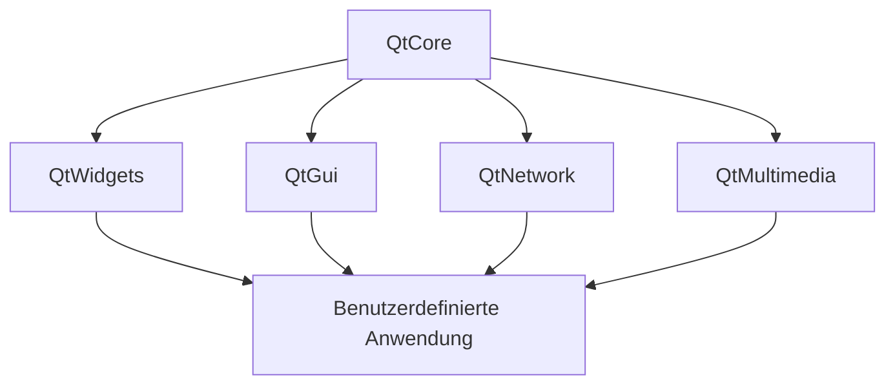
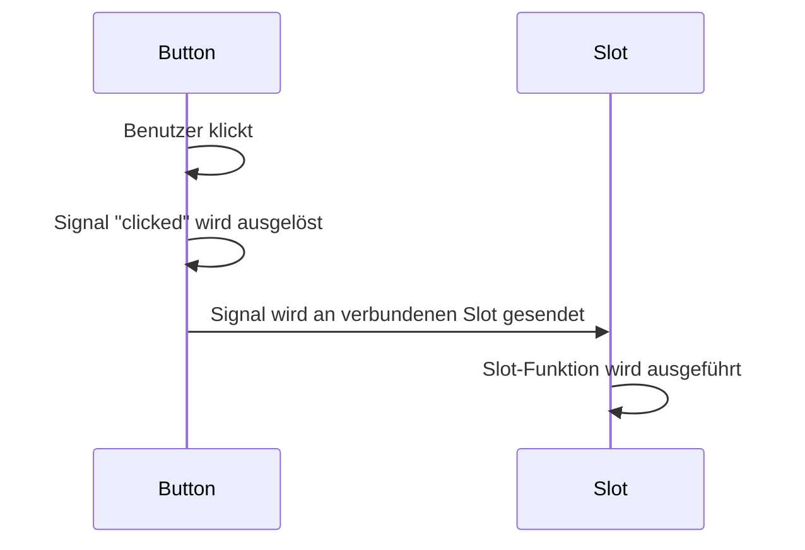
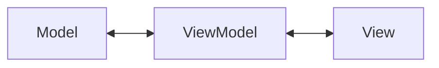

# PyQt5 Grundlagen

Diese Dokumentation bietet einen Überblick über die Grundlagen von PyQt5 und effiziente Implementierungsmuster für die
Arbeit mit CAD-Elementen unter Verwendung der cwapi3d.

## Inhaltsverzeichnis

- [Was ist PyQt5?](#was-ist-pyqt5)
- [Qt-Architektur und Funktionsweise](#qt-architektur-und-funktionsweise)
- [Effiziente PyQt5-Entwicklung](#effiziente-pyqt5-entwicklung)
- [Das MVVM-Muster](#das-mvvm-muster)
- [Praktisches Beispiel: CAD-Elementeverwaltung](#praktisches-beispiel-cad-elementeverwaltung)
- [Integration mit cwapi3d](#integration-mit-cwapi3d)

## Was ist PyQt5?

PyQt5 ist eine Python-Bibliothek, die Qt5 - ein umfangreiches C++-Framework für die Entwicklung von
plattformübergreifenden Anwendungen mit grafischer Benutzeroberfläche - in Python verfügbar macht.

PyQt5 bietet Zugriff auf:

- Widget-Bibliotheken für UI-Elemente
- Signale und Slots für ereignisgesteuerte Programmierung
- Grafikeffekte und Animationen
- Netzwerkunterstützung
- Multimedia-Funktionalitäten
- Multithreading-Unterstützung

## Qt-Architektur und Funktionsweise

QtCore ist das Fundament von Qt, auf dem alle anderen Module aufbauen. Die Architektur von Qt basiert auf mehreren
wichtigen Konzepten:



### Wichtige Konzepte in Qt:

1. **Signale und Slots**: Mechanismus für die Kommunikation zwischen Objekten (Observer-Pattern)
2. **Event Loop**: Herzstück der Anwendung, verarbeitet Ereignisse
3. **Widgets**: UI-Komponenten, die vom Benutzer gesehen und verwendet werden
4. **Layouts**: Organisieren Widgets in einer ansprechenden und responsiven Struktur
5. **Model/View-Architektur**: Trennt Daten (Modell) von Darstellung (View)

### Signal-Slot-Mechanismus




## Effiziente PyQt5-Entwicklung

Für eine effiziente Entwicklung mit PyQt5 empfehlen sich folgende Praktiken:

1. **Qt Designer verwenden**: GUI visuell erstellen und als .ui-Datei speichern
2. **Architekturen anwenden**: MVVM für saubere Codestrukturierung
3. **Ressourcen verwalten**: QRC-Dateien für eingebettete Ressourcen nutzen
4. **Multithreading**: Für rechenintensive Operationen, um UI-Blockierung zu vermeiden
5. **Stylesheet-Anpassung**: Für einheitliches und ansprechendes Design

### Beispiel für eine einfache PyQt5-Anwendung:

```python
import sys
from PyQt5.QtWidgets import QApplication, QMainWindow, QPushButton


class MainWindow(QMainWindow):
    def __init__(self):
        super().__init__()
        self.setWindowTitle("Meine erste PyQt5-App")
        self.setGeometry(100, 100, 400, 300)

        button = QPushButton("Klick mich", self)
        button.setGeometry(150, 150, 100, 30)
        button.clicked.connect(self.button_clicked)

    def button_clicked(self):
        print("Button wurde geklickt!")


if __name__ == "__main__":
    app = QApplication(sys.argv)
    window = MainWindow()
    window.show()
    sys.exit(app.exec_())
```

## Das MVVM-Muster

MVVM (Model-View-ViewModel) ist ein Architekturmuster, das besonders gut für UI-Anwendungen geeignet ist. Es teilt die
Anwendung in drei Hauptkomponenten:



1. **Model**: Repräsentiert die Daten und Geschäftslogik (enthält keine UI-Logik)
2. **View**: Zuständig für die visuelle Darstellung und Benutzerinteraktion (dumm, keine Logik)
3. **ViewModel**: Vermittler zwischen Model und View, bereitet Daten für die Anzeige vor (enthält Logik, aber keine
   UI-Elemente)

### Vorteile des MVVM-Musters:

- **Testbarkeit**: Die Komponenten können unabhängig voneinander getestet werden
- **Wartbarkeit**: Klare Trennung der Verantwortlichkeiten
- **Wiederverwendbarkeit**: Komponenten können in verschiedenen Kontexten verwendet werden
- **Designer/Entwickler-Zusammenarbeit**: Klare Trennung zwischen UI und Logik

## Praktisches Beispiel: CAD-Elementeverwaltung

Folgend ein Beispiel einer MVVM-Implementierung zur Verwaltung von CAD-Elementen, gruppiert nach Namen.

### Model: CAD-Elemente

```python
from dataclasses import dataclass
from typing import List

@dataclass(frozen=True)
class ElementGroup:
    name: str
    count: int
    elements: List

class CadElement:
    def __init__(self, element_id, name, element_type):
        self.element_id = element_id
        self.name = name
        self.element_type = element_type
        self.is_active = False

    def activate(self):
        self.is_active = True
        visualization_controller.set_active([self.element_id])

    def deactivate(self):
        self.is_active = False
        visualization_controller.set_inactive([self.element_id])
```

### ViewModel: Elementverwaltung

```python
import attribute_controller
from PyQt5.QtCore import QObject, pyqtSignal, pyqtSlot, QAbstractTableModel, Qt, QModelIndex
import element_controller as ec


class CadElementViewModel(QObject):
   elementsChanged = pyqtSignal()

   def __init__(self):
      super().__init__()
      self._elements = []
      self._load_elements()

   def _load_elements(self):

      element_ids = element_controller.get_active_identifiable_element_ids()
      self._elements = []
    
      for element_id in element_ids:
         name = attribute_controller.get_name(element_id)
         element_type: ElementType = attribute_controller.get_element_type(element_id) # .is_panel() etc. eigene Logik implementieren
         self._elements.append(CadElement(element_id, name, element_type))

      self.elementsChanged.emit() # Signal auslösen, um die Ansicht zu aktualisieren

   def get_elements_by_name(self):
      # Gruppieren der Elemente nach Namen
      grouped: Dict[str, int] = {}
      for element in self._elements:
         if element.name not in grouped:
            grouped[element.name] = []
         grouped[element.name].append(element)

      # Erzeugen einer Liste von ElementGroup Objekten
      result = []
      for name, elements in grouped.items():
         result.append(ElementGroup(name=name, count=len(elements), elements=elements))

      # Sortieren nach Namen
      return sorted(result, key=lambda x: x.name)

   @pyqtSlot(str)
   def activate_elements_by_name(self, name):
      for element in self._elements:
         if element.name == name:
            element.activate()
      self.elementsChanged.emit() # Signal auslösen, um die Ansicht zu aktualisieren


# TableModel für die Anzeige in einer QTableView
class CadElementTableModel(QAbstractTableModel): # Verwendung des Model/View-Ansatzes
   def __init__(self, view_model):
      super().__init__()
      self._view_model = view_model
      self._view_model.elementsChanged.connect(self.modelReset.emit)
      self._data = self._view_model.get_elements_by_name()

   # override
   def rowCount(self, parent=QModelIndex()):
      return len(self._data)
    # override
   def columnCount(self, parent=QModelIndex()):
      return 2  # Name und Anzahl
    # override
   def data(self, index, role=Qt.DisplayRole):
      if not index.isValid():
         return None

      if role == Qt.DisplayRole:
         row = index.row()
         col = index.column()

         if col == 0:  # Name
            return self._data[row].name
         elif col == 1:  # Anzahl
            return self._data[row].count

      return None
    # override
   def headerData(self, section, orientation, role=Qt.DisplayRole):
      if role == Qt.DisplayRole and orientation == Qt.Horizontal:
         if section == 0:
            return "Elementname"
         elif section == 1:
            return "Anzahl"
      return None
```

### View: UI-Komponente

```python
from PyQt5.QtWidgets import QWidget, QVBoxLayout, QTableView, QPushButton, QHBoxLayout
from PyQt5.QtCore import pyqtSlot


class CadElementView(QWidget):
    def __init__(self, view_model):
        super().__init__()
        self._view_model = view_model
        self._setup_ui()

    def _setup_ui(self):
        self.setWindowTitle("CAD Elementverwaltung")
        self.resize(600, 400)

        # Layout erstellen
        layout = QVBoxLayout()

        # Tabelle erstellen
        self.table_view = QTableView()
        self.table_model = CadElementTableModel(self._view_model)
        self.table_view.setModel(self.table_model)

        # Tabelle konfigurieren
        self.table_view.setSelectionBehavior(QTableView.SelectRows)
        self.table_view.setSelectionMode(QTableView.SingleSelection)
        self.table_view.horizontalHeader().setStretchLastSection(True)

        # Button zum Aktivieren hinzufügen
        activate_button = QPushButton("Ausgewählte Elemente aktivieren")
        activate_button.clicked.connect(self._on_activate_clicked)

        # Layout zusammenbauen
        layout.addWidget(self.table_view)
        layout.addWidget(activate_button)

        self.setLayout(layout)

    @pyqtSlot()
    def _on_activate_clicked(self):
        selected_indexes = self.table_view.selectionModel().selectedRows()
        if selected_indexes:
            row = selected_indexes[0].row()
            element_name = self.table_model._data[row].name
            self._view_model.activate_elements_by_name(element_name)
```

### Hauptanwendung

```python
import sys
from PyQt5.QtWidgets import QApplication

if __name__ == "__main__":
    # app = QApplication(sys.argv) # Existiert bereits in cadwork 3d

    # MVVM-Komponenten initialisieren
    view_model = CadElementViewModel()
    view = CadElementView(view_model)

    view.show()
    # sys.exit(app.exec_()) # Existiert bereits in cadwork 3d
```

