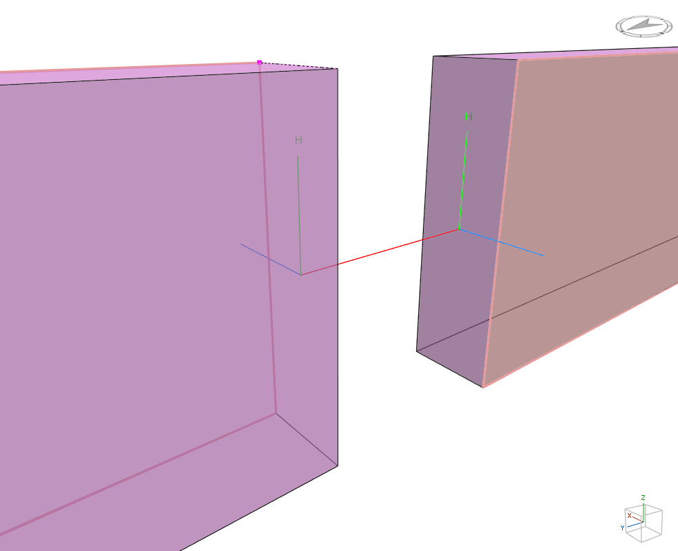
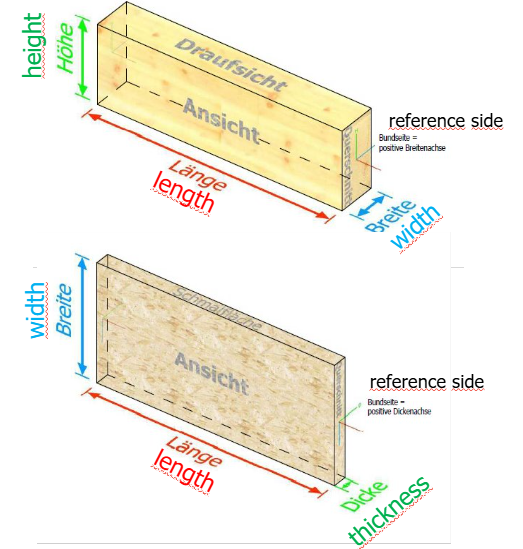

# Cadwork Axis System Dokumentation


## Vectors versus Points


In der 3D-Geometrie ist die Unterscheidung zwischen **Vektoren** und **Punkten** fundamental
wichtig, auch wenn beide mathematisch als Tripel von Zahlen dargestellt werden.

### Punkte (Points)

- **Absolute Position**: Punkte repräsentieren eine **feste Position** im 3D-Raum
- **Koordinaten**: P = (x, y, z) beschreibt eine eindeutige Stelle im globalen Koordinatensystem
- **Beispiele in cadwork**: P1, P2, P3 von Elementen sind Punkte mit absoluten Koordinaten
- **Operationen**: Punkte können verschoben, aber nicht "skaliert" werden

### Vektoren (Vectors)

- **Richtung und Länge**: Vektoren repräsentieren eine **Richtung** und **Distanz** im Raum
- **Relativ**: V = (x, y, z) beschreibt eine Verschiebung, nicht eine absolute Position
- **Beispiele in cadwork**: Normalenvektoren, Längsrichtungen, Bewegungsrichtungen
- **Operationen**: Vektoren können addiert, subtrahiert, skaliert und normalisiert werden

## Lokales Achsensystem von Elementen

In cadwork besitzen alle fertigungstechnisch relevanten Elemente ein lokales Achssystem. Dieses Achssystem wird durch
drei Punkte definiert:

- **P1**: Startpunkt des Elements
- **P2**: Endpunkt der Längsachse
- **P3**: Ein Punkt, der die Höhenachse des Bauteils festlegt

Mit diesen drei Punkten lässt sich das lokale Koordinatensystem eindeutig bestimmen, wobei die Längsachse durch P1 und
P2 definiert wird und die Höhenachse durch die Orientierung von P3 festgelegt wird.

### Rechtshändiges Koordinatensystem


Ein rechtshändiges Koordinatensystem ist ein räumliches Bezugssystem, bei dem die Orientierung der Achsen nach der
sogenannten „Rechtshandregel“ erfolgt. Dabei gilt:

- Zeigt der Daumen der rechten Hand in Richtung der X-Achse und der Zeigefinger in Richtung der Y-Achse, so zeigt der
  Mittelfinger (im rechten Winkel zu den beiden anderen) in Richtung der Z-Achse.
- Das rechtshändige System ist in der Technik und Informatik Standard, da es eine eindeutige Definition der
  Raumorientierung ermöglicht.
- Das Kreuzprodukt zweier Vektoren folgt ebenfalls der Rechtshandregel: Der resultierende Vektor steht senkrecht auf der
  durch die beiden Eingangsvektoren aufgespannten Ebene.

Diese Konvention ist wichtig, um Verwechslungen bei der Definition von Achsen und Richtungen zu vermeiden.

### Spiegelung von Elementen im rechtshändigen System

Da cadwork ausschliesslich das rechtshändige Koordinatensystem verwendet, entstehen bei Spiegeloperationen besondere
Eigenschaften:



#### Erhaltung der Händigkeit

- **Spiegelungen** ändern mathematisch die Händigkeit eines Koordinatensystems
- cadwork behält jedoch immer das rechtshändige System bei, indem gespiegelte Elemente eine **angepasste interne
  Orientierung** erhalten
- Die lokalen Achsensysteme (P1, P2, P3) werden so umgerechnet, dass die Rechtshandregel weiterhin gültig bleibt

#### Automatische Anpassung

- Bei Spiegeloperationen werden die **P1-, P2- und P3-Punkte** automatisch neu berechnet
- **Bohrungen und Bearbeitungen** behalten ihre relative Position und Orientierung zum Element bei

### Globale Koordinatenbezüge der Elementpunkte

Die Elementpunkte P1, P2 und P3 in cadwork beziehen sich immer auf das **globale Koordinatensystem** und sind daher *
*absolute Koordinaten**. Dies bedeutet:

#### Absolute Positionierung

- **P1, P2 und P3** werden als absolute Koordinaten im Weltkoordinatensystem gespeichert
- Die Punkte sind **nicht relativ** zum Element selbst, sondern **absolut** im 3D-Raum positioniert
- Jeder Punkt hat eindeutige X-, Y- und Z-Koordinaten im globalen System

#### Vorteile der absoluten Referenzierung

- **Eindeutige Positionierung**: Jedes Element hat eine absolut definierte Position und Orientierung im Raum
- **Konsistente Beziehungen**: Verbindungen zwischen Elementen können präzise berechnet werden
- **Einfache Transformation**: Verschiebungen und Rotationen erfolgen direkt über die Anpassung der Punktkoordinaten

#### Praktische Auswirkungen

- Bei **Elementverschiebungen** werden alle drei Punkte entsprechend im globalen System verschoben
- **Rotationen** um einen Punkt ändern die absoluten Koordinaten von P2 und P3
- **Kopier- und Einfügeoperationen** übertragen die absoluten Koordinaten an neue Positionen

#### Berechnung des lokalen Systems

Aus den absoluten Koordinaten wird das lokale Achsensystem abgeleitet:

- **Längsvektor**: P2 - P1 (absolute Differenz)
- **Hilfsvektor**: P3 - P1 (für Höhenorientierung)
- **Lokale Achsen**: Werden aus diesen absoluten Vektoren orthonormalisiert (Orthongonal, normalisiert)

Diese absolute Referenzierung ermöglicht eine präzise und konsistente Geometrieverarbeitung in cadwork.

Here is a section explaining plane cutting in cadwork and why it must be done this way:

### Elementschnitt mit Ebenen

Beim Schneiden von Elementen mit einer Ebene in cadwork muss die Ebene mathematisch korrekt definiert werden. Dies
erfordert zwei Parameter:

#### Ebenendefinition durch Normalenvektor und Abstand

```python
plane_normal = CwVector3d(0.000000, -0.500000, 0.866025)
plane = CwPlane3d(CwVector3d(-42.500000, 1644.450845, 3432.000000), plane_normal)
distance = plane.distance_to_point(CwVector3d(0.0, 0.0, 0.0))
```

- **Normalenvektor**: Definiert die Orientierung der Schnittebene im Raum
- **Abstand zum Ursprung**: Bestimmt die exakte Position der Ebene entlang des Normalenvektors

#### Warum diese Methode notwendig ist

**Mathematische Ebenendarstellung**: Eine Ebene im 3D-Raum wird durch die Gleichung `ax + by + cz = d` beschrieben,
wobei:

- `(a, b, c)` der normalisierte Normalenvektor ist
- `d` der Abstand der Ebene zum Koordinatenursprung ist

**Eindeutige Definition**: Der Abstand zum Ursprung ist erforderlich, weil unendlich viele parallele Ebenen denselben
Normalenvektor haben können. Nur durch den Abstand wird die Ebene eindeutig positioniert.

**Konsistenz im rechtshändigen System**: Die Richtung des Normalenvektors bestimmt, welche Seite der Ebene als "positiv"
gilt. Dies ist wichtig für:

- **Schnittrichtung**: Bestimmt, welcher Teil des Elements entfernt wird
- **Bearbeitungsreihenfolge**: Definiert die Orientierung für nachfolgende Operationen
- **Materialausrichtung**: Stellt sicher, dass geschnittene Flächen korrekt orientiert sind

#### Praktische Umsetzung

```python
ec.cut_element_with_plane(element_id, cadwork.point_3d(*plane_normal), distance)
```

Die API erwartet den Normalenvektor und den Abstand separat, da dies die effizienteste und präziseste Methode zur
Ebenendefinition darstellt. So können komplexe Schnittoperationen mathematisch exakt durchgeführt werden.

### Stäbe

Stäbe sind lineare Bauteile, die hauptsächlich zur Übertragung von Kräften in Längsrichtung verwendet werden. Das lokale
Achsensystem eines Stabes wird durch die drei Punkte P1, P2 und P3 eindeutig definiert.



#### Achsendefinition bei Stäben

```python
def create_beam_coordinate_system(p1, p2, p3):
    """Erstelle lokales Koordinatensystem für Stab-Element"""
    # X-Achse: Längsrichtung des Stabes (P1 → P2)
    x_axis = vector_normalize(vector_subtract(p2, p1))

    # Hilfsvektor für Z-Achse (P1 → P3)
    temp_z = vector_subtract(p3, p1)

    # Y-Achse: Senkrecht zu X und Z (Querrichtung)
    y_axis = vector_normalize(vector_cross_product(temp_z, x_axis))

    # Z-Achse: Höhenrichtung (rechtshändiges System)
    z_axis = vector_cross_product(x_axis, y_axis)

    return x_axis, y_axis, z_axis
```

**Stab-Achskonvention:**

- **X-Achse (Längsrichtung)**: Definiert die Hauptrichtung des Stabes von P1 zu P2
- **Y-Achse (Querrichtung)**: Steht senkrecht zur Längsrichtung und definiert die Breitenorientierung
- **Z-Achse (Höhenrichtung)**: Definiert die Höhe des Stabquerschnitts senkrecht zur X-Y-Ebene

#### Querschnittsorientierung

Die Orientierung des Stabquerschnitts wird durch P3 bestimmt:

- **P3 Position**: Bestimmt die Richtung der Z-Achse (Höhenrichtung)
- **Starke Achse**: Typischerweise die Z-Achse bei rechteckigen Querschnitten
- **Schwache Achse**: Typischerweise die Y-Achse bei rechteckigen Querschnitten

### Platten

Platten sind flächige Bauteile mit geringer Dicke im Verhältnis zu ihren anderen Abmessungen. Das lokale Achsensystem
definiert die Orientierung und Bearbeitungsrichtungen:

#### Achsendefinition bei Platten

```python
def create_panel_coordinate_system(p1, p2, p3):
    """Erstelle lokales Koordinatensystem für Platten-Element"""
    # X-Achse: Längsrichtung der Platte (P1 → P2)
    x_axis = vector_normalize(vector_subtract(p2, p1))

    # Hilfsvektor in Plattenebene (P1 → P3)
    temp_width = vector_subtract(p3, p1)

    # Y-Achse: Breitenrichtung (in Plattenebene, senkrecht zu X)
    y_axis = vector_normalize(vector_subtract(temp_width,
                                              vector_multiply_scalar(x_axis,
                                                                     vector_dot_product(temp_width, x_axis))))

    # Z-Achse: Dickenrichtung (senkrecht zur Plattenebene)
    z_axis = vector_cross_product(x_axis, y_axis)

    return x_axis, y_axis, z_axis
```

**Platten-Achskonvention:**

- **X-Achse (Längsrichtung)**: Hauptrichtung der Platte, meist die längste Seite
- **Y-Achse (Breitenrichtung)**: Liegt in der Plattenebene, senkrecht zur X-Achse
- **Z-Achse (Dickenrichtung)**: Steht senkrecht zur Plattenebene und definiert die Dickenrichtung

#### Plattenorientierung und Bearbeitung

Die Z-Achse (Dickenrichtung) ist entscheidend für:

- **Oberflächenbearbeitung**: Bestimmt die Bearbeitungsseite
- **Materialrichtung**: Definiert Faserrichtung bei Holzwerkstoffen
- **Verbindungselemente**: Orientierung von Schrauben und Dübeln

