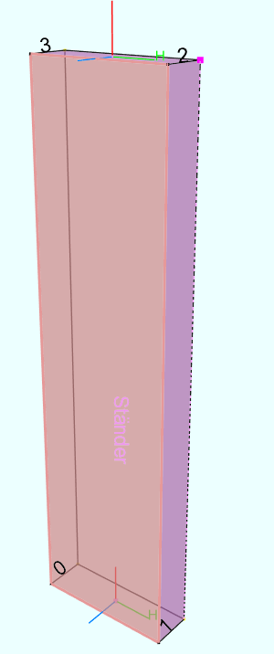
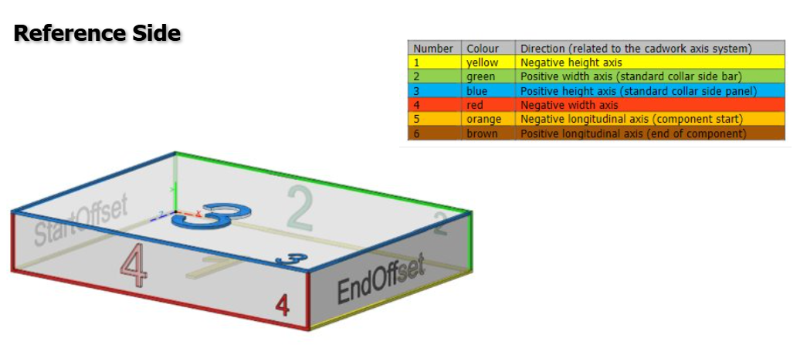

# cadwork 3D-Element

Ein `cadwork` 3D-Element repräsentiert ein **räumlich ausgerichtetes Bauteil** mit eigener Geometrie und einem **lokalen
Koordinatensystem**.
Es basiert auf einem **BREP-Modell (Boundary Representation)** und ist **absolut im Raum platziert**.

---

### Referenzseite des Elements

Die **Referenzseite** eines cadwork-3D-Elements ist die Fläche, die im **lokalen Koordinatensystem** in **positive
Z-Richtung** zeigt.

#### Bedeutung:

* Diese Fläche ist **topologisch** und **semantisch** die **"Oberseite"** des Elements.
* In der Werkplanung, Visualisierung dient sie oft als **Bezugsfläche**.

---

### Merksatz

> **Die Fläche, die auf der positiven Z-Achse liegt, ist die technische Referenzseite des Bauteils.**

---


---

## Lokales Koordinatensystem

Jedes 3D-Element besitzt ein **eigenes lokales Koordinatensystem**, das über drei Referenzpunkte definiert wird:

| Punkt  | Bedeutung                                               |              |
|--------|---------------------------------------------------------|--------------|
| **P1** | Ursprung des lokalen Koordinatensystems                 | Location     |
| **P2** | Definiert die **Längsachse** (X-Achse)                  | Axis         |
| **P3** | Definiert die **Höhenrichtung** (Z-Achse) relativ zu P1 | RefDirection |

### Achsdefinition

- **X-Achse (Längsachse)**: Verläuft von **P1 → P2**
- **Z-Achse (Höhenachse)**: Wird durch **P1 → P3** definiert
- **Y-Achse**: Wird rechthändig über das Kreuzprodukt berechnet  
  `Y = Z × X` (Rechte-Hand-Regel)

---

## Beispiel zur Orientierung

```text
P1: (0, 0, 0)
P2: (1, 0, 0) → X-Achse
P3: (0, 0, 1) → Z-Achse

````

---

## Geometrische Repräsentation: BREP

Die Form des Elements wird über eine **Boundary Representation (BREP)** gespeichert.
Das bedeutet:

* Die Geometrie wird durch **Flächen, Kanten und Punkte** definiert
* Jede Fläche hat eine definierte **Orientierung** (Normalenrichtung)
* Das Modell ist **geschlossen** (solid) und **wasserdicht**

### Vorteile von BREP:

* Exakte Geometrie (nicht nur trianguliert)
* Kompatibel mit Booleschen Operationen
* Ermöglicht präzise Fertigungsdaten und Simulation

---

## Absolute Platzierung

Obwohl jedes Element ein **lokales Koordinatensystem** besitzt, wird es **absolut im Weltkoordinatensystem platziert**.
Das bedeutet:

* Die Punkte P1, P2, P3 liegen bereits in **Weltkoordinaten**
* Keine Matrixtransformation mehr notwendig bei der Interpretation
* Die Ausrichtung im Raum ist direkt ablesbar

---

## 🔄 Zusammenfassung

| Eigenschaft      | Beschreibung                            |
|------------------|-----------------------------------------|
| Lokales KS       | Definiert durch P1, P2, P3              |
| Längsrichtung    | P1 → P2 (X-Achse)                       |
| Höhe/Ausrichtung | P1 → P3 (Z-Achse)                       |
| Geometrie        | BREP – Boundary Representation          |
| Platzierung      | Absolut im Raum (keine Relativtransfos) |

---

* [BREP Grundlagen auf Wikipedia](https://en.wikipedia.org/wiki/Boundary_representation)

---

## ReferenceSide


